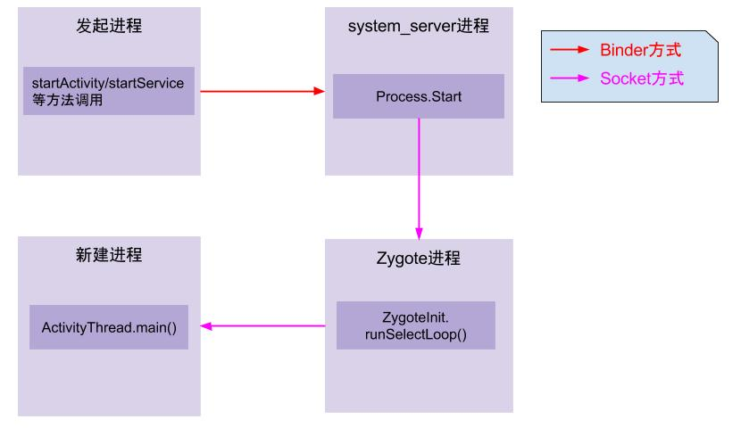
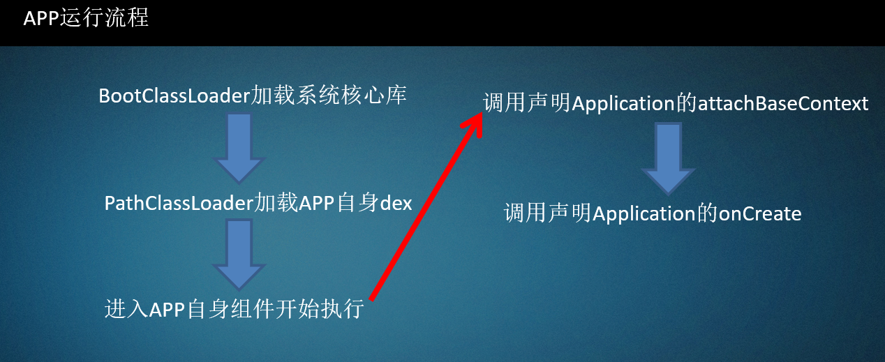
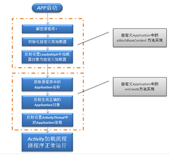
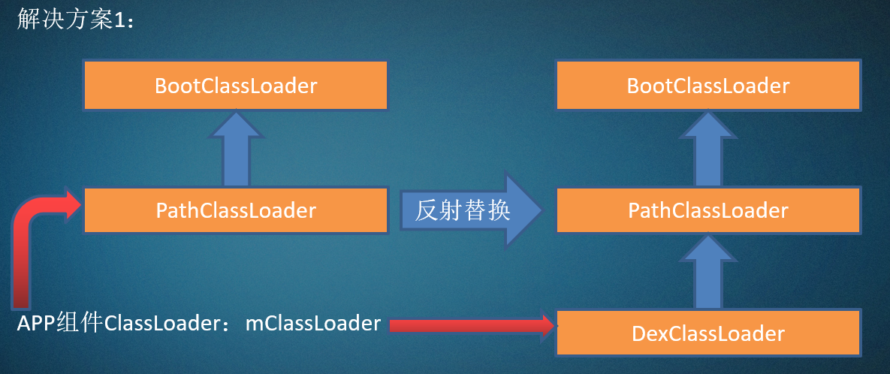
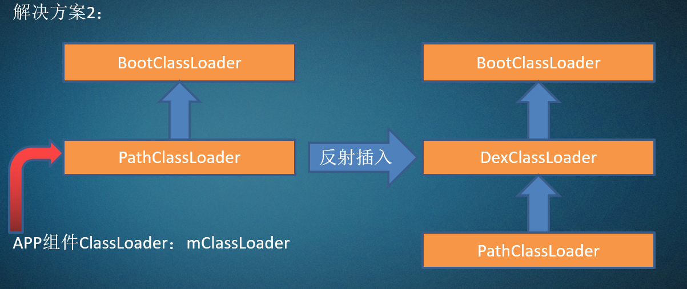
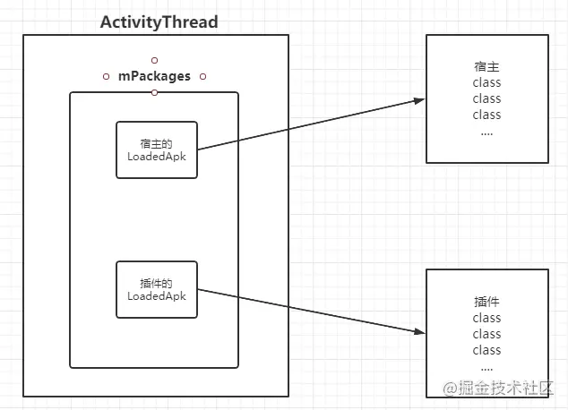

这里以一张图说明**App进程的创建流程**：



图解：

1. **App发起进程**：当从桌面启动应用，则发起进程便是Launcher所在进程；当从某App内启动远程进程，则发送进程便是该App所在进程。发起进程先通过binder发送消息给system_server进程；
2. **system_server进程**：调用Process.start()方法，通过socket向zygote进程发送创建新进程的请求；
3. **zygote进程**：在执行`ZygoteInit.main()`后便进入`runSelectLoop()`循环体内，当有客户端连接时便会执行ZygoteConnection.runOnce()方法，再经过层层调用后fork出新的应用进程；
4. **新进程**：执行handleChildProc方法，最后调用ActivityThread.main()方法。


通过Zygote进程到最终进入到app进程世界，我们可以看到ActivityThread.main()是进入App世界的大门，在ActivityThread()调用之前都不会运行APK的代码。

**APP运行流程：**



**attachBaseContext**这个方法是application初始化之后会立即被执行的方法，其次才是onCreate方法，当然application并不是安卓程序的入口，安卓应用程序作为一个控制类程序，跟Java程序类似，都是有一个入口的，而**这个入口就是ActivityThread**, ActiviyThread也有一个main方法，这个main方法是安卓应用程序真正的入口，Activity其实就一个普普通通的Java对象，利用反射创建，然后由ClassLoader加载进去，之后由框架层的调用，从而具有了生命周期，成为了一个组件，从而也可以知道在插件化中，仅仅加载Activity是不行的，还必须交给框架层去调用才具有生命力，不然没意义，当然了，不仅是Activity,其实，Service,BroadCase,等都是这样由反射创建，然后加载由框架层调用的。

对于ActivityThread这个类，其中的sCurrentActivityThread静态变量用于全局保存创建的ActivityThread实例，同时还提供了public static ActivityThread currentActivityThread()静态函数用于获取当前虚拟机创建的ActivityThread实例。ActivityThread.main()函数是java中的入口main函数,这里会启动主消息循环，并创建ActivityThread实例，之后调用thread.attach(false)完成一系列初始化准备工作，并完成全局静态变量sCurrentActivityThread的初始化。之后主线程进入消息循环，等待接收来自系统的消息。当收到系统发送来的bindapplication的进程间调用时，调用函数handlebindapplication来处理该请求

```java
private void handleBindApplication(AppBindData data) {
    //step 1: 创建LoadedApk对象
    data.info = getPackageInfoNoCheck(data.appInfo, data.compatInfo);
    ...
    //step 2: 创建ContextImpl对象;
    final ContextImpl appContext = ContextImpl.createAppContext(this, data.info);
 
    //step 3: 创建Instrumentation
    mInstrumentation = new Instrumentation();
 
    //step 4: 创建Application对象;在makeApplication函数中调用了newApplication，在该函数中又调用了app.attach(context)，在attach函数中调用了Application.attachBaseContext函数
    Application app = data.info.makeApplication(data.restrictedBackupMode, null);
    mInitialApplication = app;
 
    //step 5: 安装providers
    List<ProviderInfo> providers = data.providers;
    installContentProviders(app, providers);
 
    //step 6: 执行Application.Create回调
    mInstrumentation.callApplicationOnCreate(app);
```


在 handleBindApplication函数中第一次进入了app的代码世界，该函数功能是启动一个application，并把系统收集的apk组件等相关信息绑定到application里，在创建完application对象后，接着调用了application的attachBaseContext方法，之后调用了application的onCreate函数。由此可以发现，**app的Application类中的attachBaseContext和onCreate这两个函数是最先获取执行权进行代码执行的。这也是为什么各家的加固工具的主要逻辑都是通过替换app入口Application，并自实现这两个函数，在这两个函数中进行代码的脱壳以及执行权交付的原因。**

 **加壳应用的运行流程**



**当壳在函数attachBaseContext和onCreate中执行完加密的dex文件的解密后**，**通过自定义的Classloader在内存中加载解密后的dex文件**。为了解决后续应用在加载执行解密后的dex文件中的Class和Method的问题，接下来就是通过利用java的反射修复一系列的变量。**其中最为重要的一个变量就是应用运行中的Classloader，只有Classloader被修正后，应用才能够正常的加载并调用dex中的类和方法，否则的话由于Classloader的双亲委派机制，最终会报ClassNotFound异常，应用崩溃退出，**这是加固厂商不愿意看到的。由此可见Classloader是一个至关重要的变量，所有的应用中加载的dex文件最终都在应用的Classloader中。

**因此，只要获取到加固应用最终通过反射设置后的Classloader，我们就可以通过一系列反射最终获取到当前应用所加载的解密后的内存中的Dex文件。**

随着加壳技术的发展，为了对抗dex整体加固更易于内存dump来得到原始dex的问题，各加固厂商又结合hook技术，通过hook dex文件中类和方法加载执行过程中的关键流程，来实现在函数执行前才进行解密操作的指令抽取的解决方案。此时，就算是对内存中的dex整体进行了dump，但是由于其方法的最为重要的函数体中的指令被加密，导致无法对相关的函数进行脱壳。由此，Fupk3诞生了，该脱壳工具通过欺骗壳而主动调用dex中的各个函数，完成调用流程，让壳主动解密对应method的指令区域，从而完成对指令抽取型壳的脱壳。

**我们在loadDex中可以实现对第三方Dex文件中函数的加载运行，但是无法进行Activity等组件。是因为**

DexClassLoader加载的类是没有组件生命周期的，也就是说即使DexClassLoader通过对APK的动态加载完成了对组件类的加载，当系统启动该组件时，依然会出现加载类失败的异常。为什么组件类被动态加载入虚拟机，但系统却出现加载类失败呢？


两种解决方案：

1、替换系统组件类加载器mClassLoader为我们的DexClassLoader，同时设置DexClassLoader的parent为系统组件类加载器；

2、打破原有的双亲关系，在系统组件类加载器和BootClassLoader的中间插入我们自己的DexClassLoader即可；



mClassLoader：四大组件加载的classloader



- 使用dexloader加载函数：

```java
public void testLoadDexClassLoader(Context context, String dexfilepath) throws NoSuchMethodException {
        //用于存放提取出来的dex
        File optfile = context.getDir("opt_dex", 0);
        //存放so文件
        File libfile = context.getDir("lib_path", 0);
        ClassLoader tmpClassLoader = context.getClassLoader();
        //1.加载的dex路径， 2优化的dex路径，3lib路径
        //使用dexclassloader进行第三方dex的加载，可以调用函数，但是不能赋予组件生命周期
        DexClassLoader dexClassLoader = new DexClassLoader(dexfilepath, optfile.getAbsolutePath(),  libfile.getAbsolutePath(), MainActivity.class.getClassLoader());
        //反射获取3.dex的TestClass类
        Class<?> clazz = null;
        try{
            //加载需要调用的类
           clazz =  dexClassLoader.loadClass("com.example.test.TestClass");

        } catch (ClassNotFoundException e) {
            e.printStackTrace();
        }
        //clazz类加载成功
        if(clazz != null){
            //使用反射获取函数名
            try{ Method testFunMethod = clazz.getDeclaredMethod("testFunc");
                //由于testFunc不是静态函数，需要实例化一个object对它进行调用
                Object obj = clazz.newInstance();
                testFunMethod.invoke(obj);
            } catch (NoSuchMethodException e) {
                e.printStackTrace();
            } catch (SecurityException e) {
                e.printStackTrace();
            } catch (IllegalAccessException e) {
                e.printStackTrace();
            } catch (InstantiationException e) {
                e.printStackTrace();
            } catch (InvocationTargetException e) {
                e.printStackTrace();
            }
        }

    }
```

**方式一：**

**Activity** 调用 **startActivity** 之后最后会在 **ActivityThread** 执行 **handleLaunchActivity**

我们直接跟进这个方法查到我们的 **Activity** 初始化就是由 **LoadedApk** 里面的 **mClassLoader**进行加载的。由此得到我们的Hook点，我们如果自定定义一个LoadedApk 并把里面的 **mClassLoader** 给替换为我们自己的 **ClassLoader** 就可以加载插件的类了。由以下图中可以看出，我们在回调 **handleLaunchActivity()** 之前会通过 **getPackageInfoNoCheck()** 方法初始化我们的 **LoadedApk** 对象，并存放如全局的变量 **mPackages** 中，所以我们要创建一个插件的 **LoadedApk** 并且把它添加到 **mPackages** 这个集合中就行了。



前面我们查看源码可以得到，**ActivityThread** 里面有个存放 **LoadedApk** 的集合为 **mPackages**，所以我们首先获取到这个变量，其次自定义我们的 **LoadedApk**，由于 LoadedApk是不对开发人员开放的，所以我们只能通过上面讲到的 **getPackageInfoNoCheck()** 方法来返回一个 LoadedApk 实例，接着拿到 自定义一个 ClassLoader，把 LoadedApk 里面的mClassLoader替换为我们自己定义的 ClassLoader。最后把我们自定义的 LoadedApk 存入 mPackages 这个集合中。

简单流程分析为：

1、反射获取 **ActivityThread** 的 **mPackages**

2、通过反射从**mPackages**找到**LoadedAPK**

3、自定义一个**dexClassLoader**

4、反射 **LoadedApk** 的 **mClassLoader**，并将自定义的 **ClassLoader** 赋值给它

5、把自定义的 **LoadedApk** 存入 **mPackages** 中

代码：

```java
    public void startTestActivity(Context context, String dexfilepath){

        File optfile = context.getDir("opt_dex", 0);
        File libfile = context.getDir("lib_path", 0);
        ClassLoader tmpClassLoader = context.getClassLoader();
        DexClassLoader dexClassLoader = new DexClassLoader(dexfilepath, optfile.getAbsolutePath(),  libfile.getAbsolutePath(), MainActivity.class.getClassLoader());
        //在这个函数实现dexClassLoader对mClassloader的替换
        replaceClassLoader(dexClassLoader);
        Class<?> clazz = null;
        try{
            //加载需要调用的类
            clazz =  dexClassLoader.loadClass("com.example.test.TestActivity");

        } catch (ClassNotFoundException e) {
            e.printStackTrace();
        }
        //类加载成功
       // Log.i("flame", "startTestActivity: iii");
        context.startActivity(new Intent(context, clazz));

    }
   
   public void replaceClassLoader(ClassLoader classLoader){
        try {

            //反射调用使用dexclassloader加载当前的ActivityThread,也就是APP进程入口
            Class<?> ActivityThreadClazz = classLoader.loadClass("android.app.ActivityThread");
            //获取到当前的Activity线程
            Method currentActivityThreadMethod = ActivityThreadClazz.getDeclaredMethod("currentActivityThread");
            //静态可以直接调用
            Object activityThreadObj = currentActivityThreadMethod.invoke(null);
            //在Java反射中Field用于获取某个类的属性或该属性的属性值
            // final ArrayMap<String, WeakReference<LoadedApk>> mPackages = new ArrayMap<>();
            //找到mPackage
            Field mPackagesFiled = ActivityThreadClazz.getDeclaredField("mPackages");
            mPackagesFiled.setAccessible(true);
            //ArrayMap mPackageObj = (ArrayMap) mPackagesFiled.get(activityThreadObj);
            ArrayMap mPackageObj = (ArrayMap) mPackagesFiled.get(activityThreadObj);
            //从mPackage中取出LoadedAPK，也就是当前的包名
            WeakReference wr = (WeakReference) mPackageObj.get(this.getPackageName());
            //获取到loadedapk
            Object loadedApkObj = wr.get();

            //加载到LoadedAPK类，用来寻找mClassLoader
            Class LoadedApkClazz = classLoader.loadClass("android.app.LoadedApk");

            //private ClassLoader mClassLoader
            Field mCLassLoader = LoadedApkClazz.getDeclaredField("mClassLoader");
            mCLassLoader.setAccessible(true);
            mCLassLoader.set(loadedApkObj, classLoader);

        } catch (ClassNotFoundException e) {
            e.printStackTrace();
        } catch (NoSuchMethodException e) {
            e.printStackTrace();
        } catch (IllegalAccessException e) {
            e.printStackTrace();
        } catch (InvocationTargetException e) {
            e.printStackTrace();
        } catch (NoSuchFieldException e) {
            e.printStackTrace();
        }
    }
```

**方式二：**

```java
public void startTestActivitySecondMrthod(Context context, String dexfilepath){
        //用于存放提取出来的dex
        File optfile = context.getDir("opt_dex", 0);
        //存放so文件
        File libfile = context.getDir("lib_path", 0);
        ClassLoader pathClassLoader = MainActivity.class.getClassLoader();
        ClassLoader bootClassloader = MainActivity.class.getClassLoader().getParent();
        //1. 将dexClassloader的父节点设置为bootclassloader
        DexClassLoader dexClassLoader = new DexClassLoader(dexfilepath, optfile.getAbsolutePath(),  libfile.getAbsolutePath(), bootClassloader);
        //2.将pathclassloader的父节点设置为dexclassloader
        try {
            Field parentFeild = ClassLoader.class.getDeclaredField("parent");
            parentFeild.setAccessible(true);
            parentFeild.set(pathClassLoader, dexClassLoader);
        } catch (NoSuchFieldException e) {
            e.printStackTrace();
        } catch (IllegalAccessException e) {
            e.printStackTrace();
        }
        /*
        * I/flame: this:dalvik.system.PathClassLoader[DexPathList[[zip file "/data/app/com.flame.loaddex-IdV4PEcCY4Jw6QP1seNBQg==/base.apk"],nativeLibraryDirectories=[/data/app/com.flame.loaddex-IdV4PEcCY4Jw6QP1seNBQg==/lib/arm64, /system/lib64, /system/product/lib64]]]
        * --parent:dalvik.system.DexClassLoader[DexPathList[[dex file "/sdcard/5.dex"],nativeLibraryDirectories=[/data/user/0/com.flame.loaddex/app_lib_path, /system/lib64, /system/product/lib64]]]
I/flame: this:dalvik.system.DexClassLoader[DexPathList[[dex file "/sdcard/5.dex"],nativeLibraryDirectories=[/data/user/0/com.flame.loaddex/app_lib_path, /system/lib64, /system/product/lib64]]]
* --parent:java.lang.BootClassLoader@3fad21*/
        ClassLoader tmpClassloader = pathClassLoader;
        ClassLoader parentClassloader = pathClassLoader.getParent();
        while(parentClassloader != null){
            Log.i("flame", "this:" + tmpClassloader + "--parent:" + parentClassloader);
            tmpClassloader = parentClassloader;
            parentClassloader = parentClassloader.getParent();
        }
        Log.i("flame", "root:" + tmpClassloader);

        Class<?> clazz = null;
        try{
            //加载需要调用的类
            clazz =  dexClassLoader.loadClass("com.example.test.TestActivity");

        } catch (ClassNotFoundException e) {
            e.printStackTrace();
        }
        //类加载成功
        // Log.i("flame", "startTestActivity: iii");
        context.startActivity(new Intent(context, clazz));

    }
```

